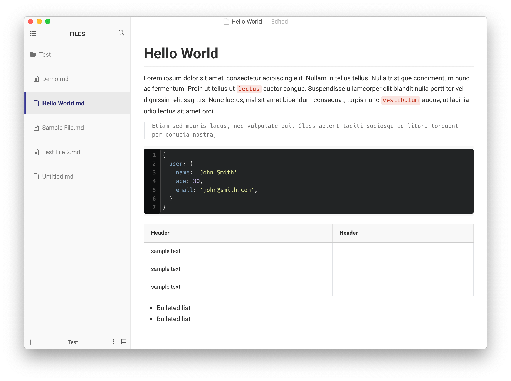
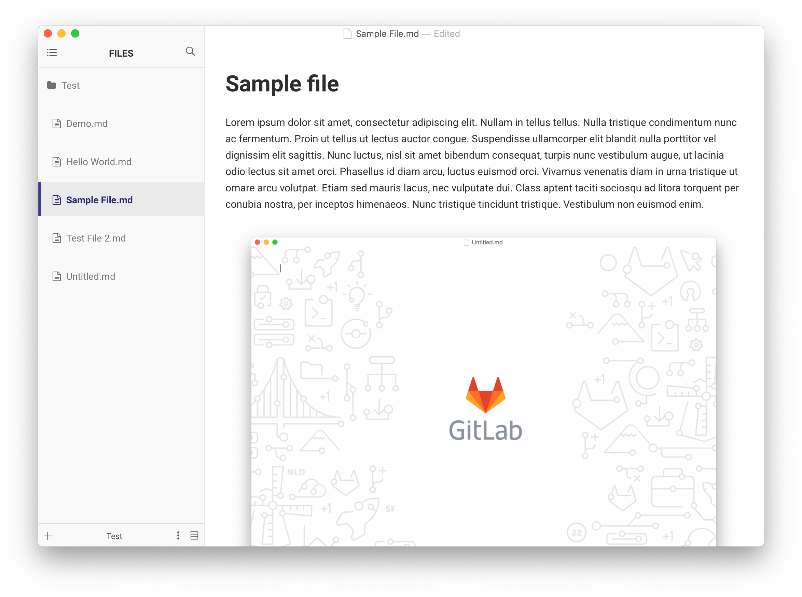

# Gitlab

Created by [Kent Pribbernow](http://www.kentpribbernow.com)

A Typora theme that looks and feels like Gitlab's familiar markdown style.

#### If you like this theme, consider donating. 

## Installation instructions

* Download the zipped project package.
* Copy the `gitlab.css` file and `gitlab` folder to your Typora theme library.
* Launch or restart Typora and choose `Gitlab` from the theme menu.

### Creating a new file - splash screen

### Full support for Gitlab markdown style

