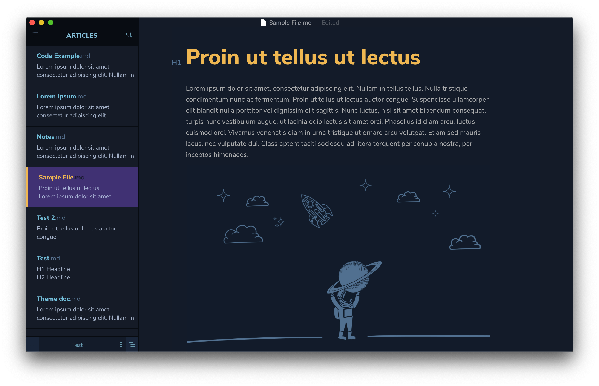
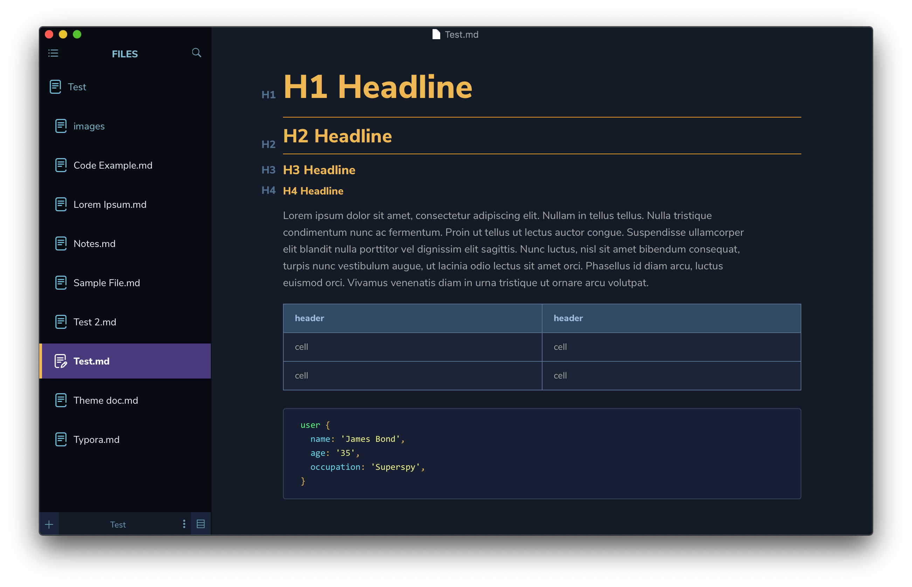

# Cobalt

Created by [Kent Pribbernow](http://www.kentpribbernow.com) 

A dark theme inspired by Wes Bos's [Cobalt](https://www.github.com/wesbos) theme for Sublime.

#### If you like this theme, consider donating. 

## Installation instructions

1. Download the zipped project package and open it.
2. Launch Typora and open `Preferences` from the app menu.
3. Go to the `Appearance` tab, and choose `Open Theme Folder`
4. Copy the `cobalt.css` file and `cobalt` folder from your zipped file to Typora theme directory.
5. Launch or restart Typora and choose `Cobalt` from the theme menu.

## Themes forked from it

### [Hivacruz](/fork/Hivacruz/)

[Hivacruz](/fork/Hivacruz/) is a theme that looks as beautiful as Cobalt with a better sidebar and some other changes.

#### Preview

