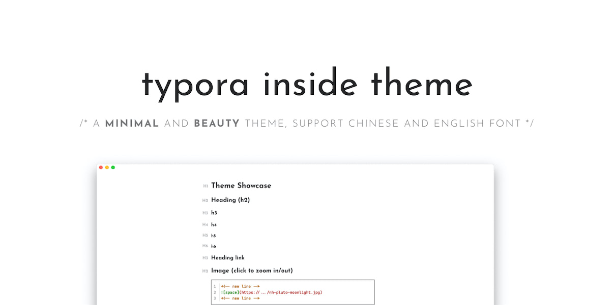
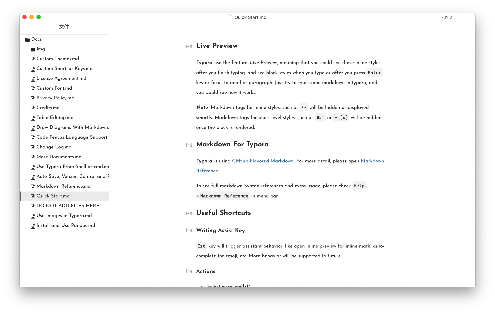
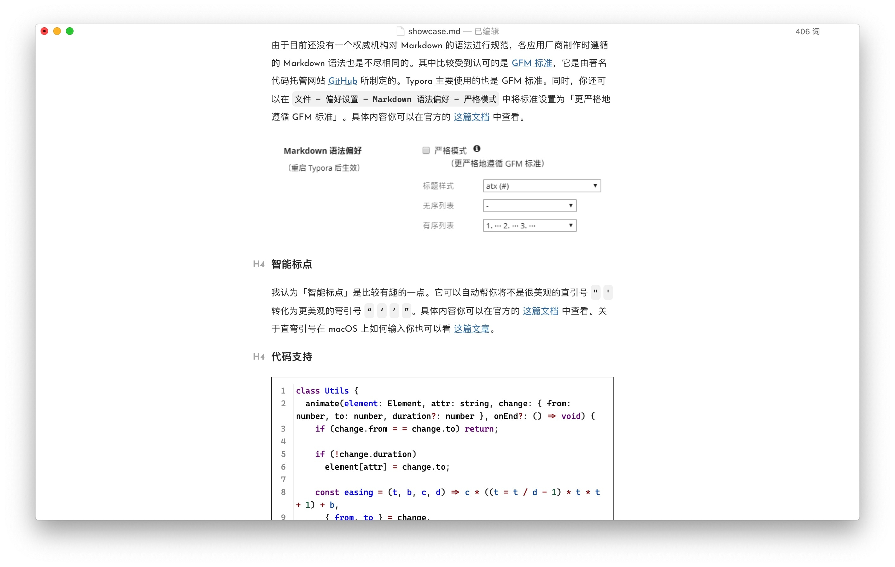
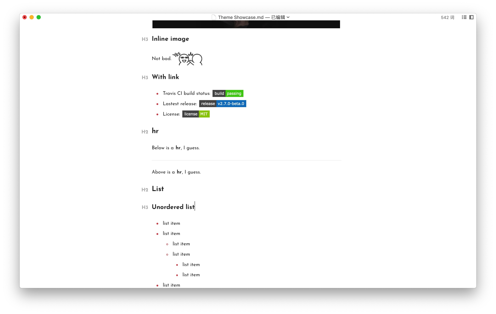

# Typora-inside-theme

  

> This is a typora theme inspired by a Hexo [inside](https://github.com/ikeq/hexo-theme-inside) theme.

# Install

1. Download this zip from Github, extract this file, then you can get the `Inside` folder and `inside.css` .
2. Open typora, click `Preference` → `Apperance` → `Open Theme Folder `.
3. Put `Inside` folder and `inside.css` into the open folder.
4. Close Typora totally, reopen Typora and select `Theme` → `inside` from the menu bar.

# Screenshot

> Designed and tested on macOS. Not fully tested, but should work for Windows/Linux. But this theme does not include styles for Windows "unibody" style.
