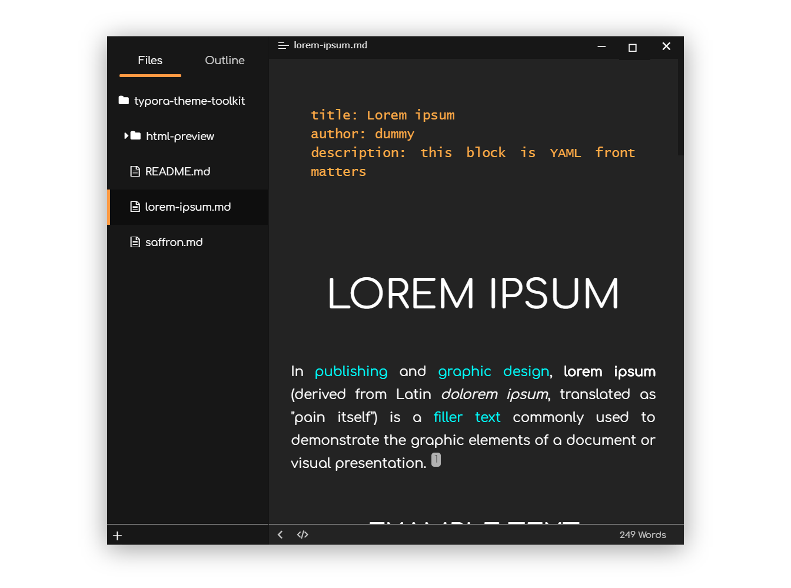

# Saffron theme for Typora

> **Note:** Designed and tested on Windows/Linux with full Unibody support. Theoretically they should work on MacOS, but if not - the Github issues page is not going to be filled by itself.

## Installation instructions

1. Download the zipped project package.
2. Copy the `saffron.css` file and `saffron` folder to your Typora theme library.
3. Launch or restart Typora and choose `Saffron` from the theme menu.

---

## Sample Views

### File List

### Tree View

### Settings Page

---

## Credits

1. The color inspiration came from my motherland's flag.
2. Font used is [Comfortaa](https://fonts.google.com/specimen/Comfortaa?query=comfortaa) - got from Google Fonts.
