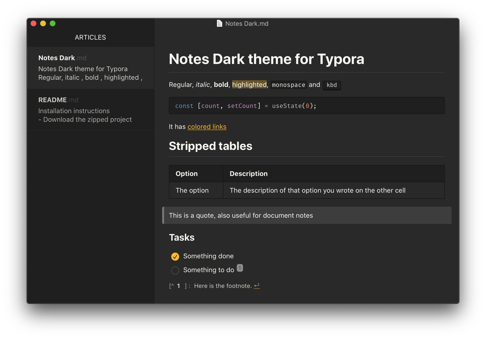

An elegant dark theme inspired by Apple Notes app

## Installation instructions
- Download the [zipped project package](https://github.com/adesurirey/typora-notes-dark-theme/archive/master.zip).
- Copy the `notes-dark.css` file and `notes-dark` folder to your Typora theme library.
- Launch or restart Typora and choose `Notes Dark` from the theme menu.