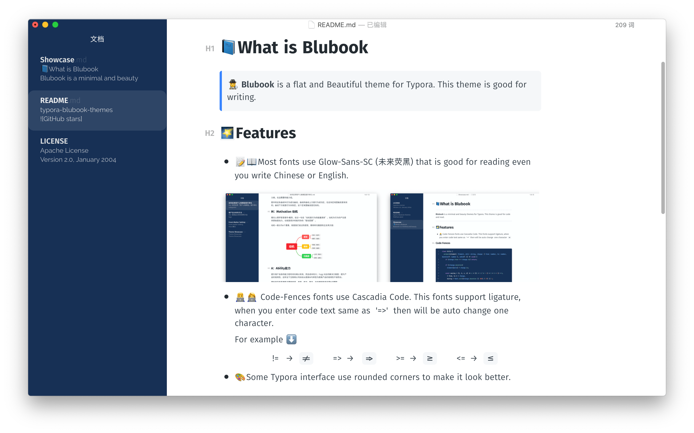
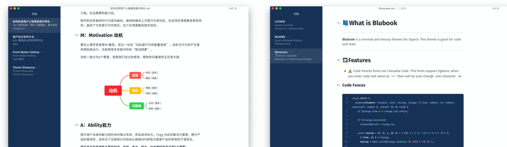
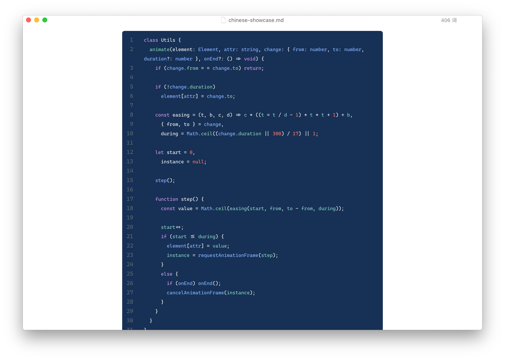

# typora-blubook-themes

## 📘What is Blubook

> 🕵️ **Blubook** is a flat and Beautiful theme for Typora. This theme is good for writing. 

## 🌠Features

- 📝📖Most fonts use Glow-Sans-SC (未来荧黑) that is good for reading even you write Chinese or English.

- 🎨Some Typora interface use rounded corners to make it look better.

> ​	🕵️ Tips: Typora sidebar use File-List-Mode will be better.

- 👨‍💻‍👩‍💻 Code-Fences fonts use Cascadia Code. This fonts support ligature, when you enter code text same as  '=>'  then will be auto change one character.

   For example ⬇️

   

- ⌨️Code example.

   

## 🔨Install

1. Download [this](https://github.com/FishionYu/typora-blubook-theme/releases/latest) zip from Github, extract this file, then you can get the `blubook` folder and `blubook.css` .
2. Open typora, click `Preference` → `Apperance` → `Open Theme Folder `.
3. Put `blubook` folder and `blubook.css` into the open folder.
4. Close Typora totally, reopen Typora and select `Theme` → `inside` from the menu bar.

> Designed and tested on macOS. Not fully tested, but should work for Windows/Linux. But this theme does not include styles for Windows "unibody" style.