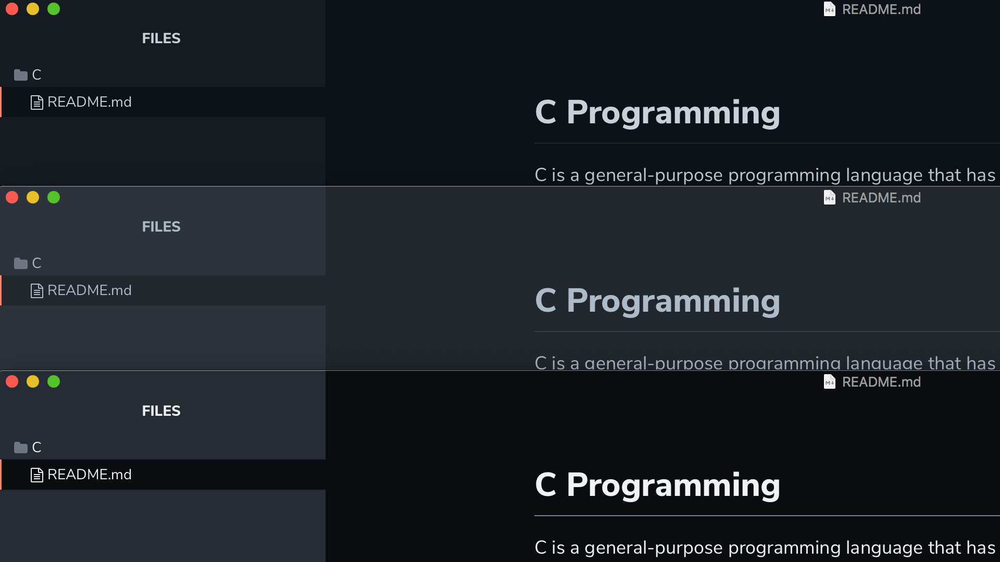

# GitHub Night Themes for Typora

Three dark themes that reproduces the new GitHub Dark Themes, recently deployed on their website:

* Github Night *Default Dark* ;
* GitHub Night *Dark dimmed* ;
* GitHub Night *High Contrast*.

## Installation

1. Download the zipped project package or the [latest stable release](https://github.com/kinoute/typora-github-night-theme/releases).
2. Launch Typora and open `Preferences` from the app menu.
3. Go to the `Appearance` tab, and choose `Open Theme Folder`.
4. Copy all the `github-night*.css` files and the `github-night` folder to your Typora theme library.
5. Launch or restart Typora and choose one of the `Github Night` themes from the theme menu.

## Screenshots

All the screenshots below feature the default GitHub Night Dark Theme, "GitHub Night".

### Articles

###  Source Mode

### Focus Mode

### Code Blocks & Folders Menu

### Plan

## Other theme in Typora

I made another theme for Typora, a dark blue one. It's called "Hivacruz" and you can find it here: https://github.com/kinoute/typora-hivacruz-theme.

## Other themes in other apps

I made other themes for different applications. Here there are:

- Sublime Text theme: https://github.com/kinoute/hivacruz-sublime-theme
- VSCode Theme: https://github.com/kinoute/vscode-hivacruz-theme
- Vim Theme: https://github.com/kinoute/vim-hivacruz-theme
- iTerm2: https://github.com/kinoute/hivacruz-itermcolors
- Nova: https://github.com/kinoute/hivacruz-nova-theme

## Credits

* Created by [Yann Defretin](https://github.com/kinoute).
* Based on the official GitHub Dark Themes available on their website.
* The Font used is [Nunito](https://fonts.google.com/specimen/Nunito) designed by Vernon Adams.
* The font used for Code Blocks is [San Francisco Mono](https://developer.apple.com/fonts/) by Apple.

