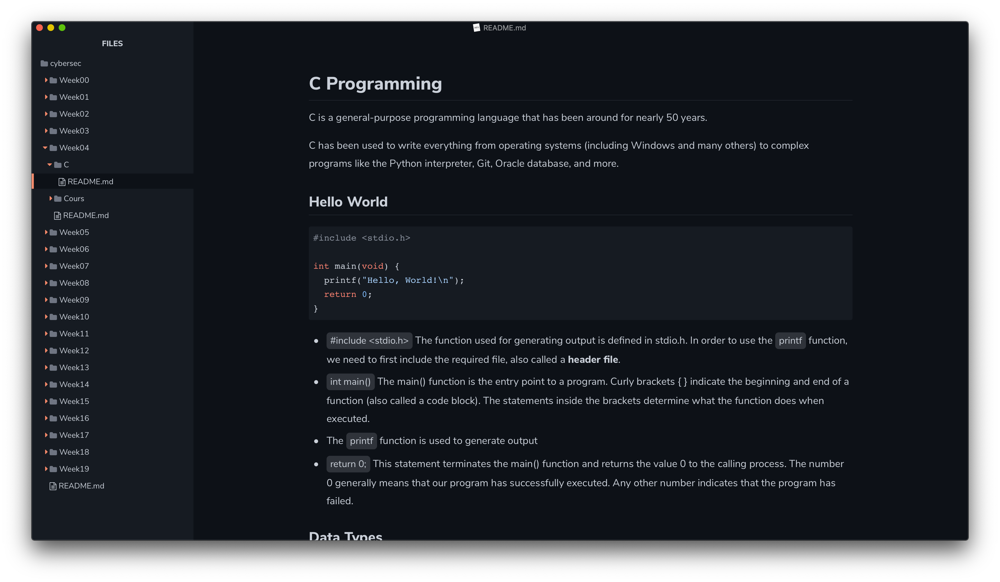
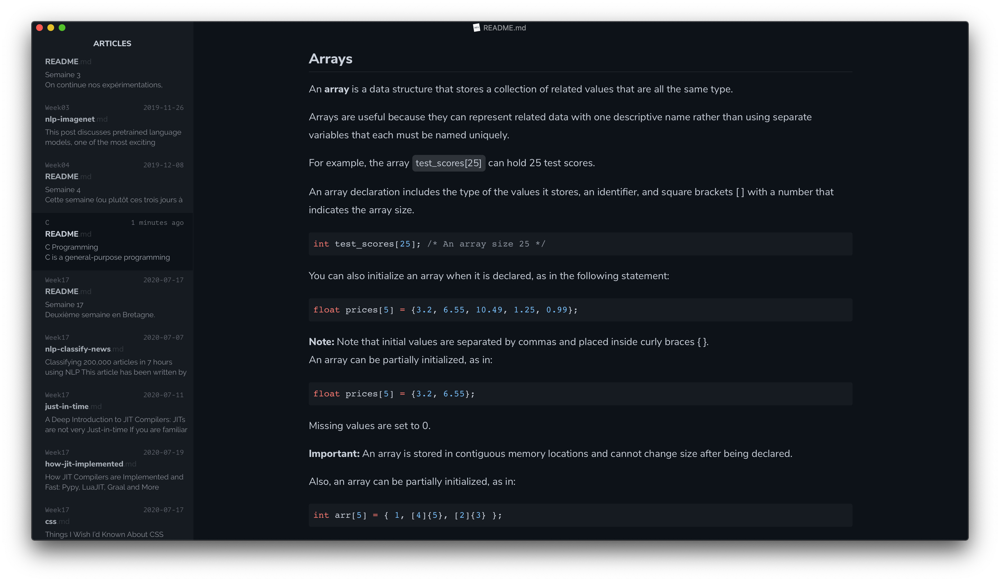
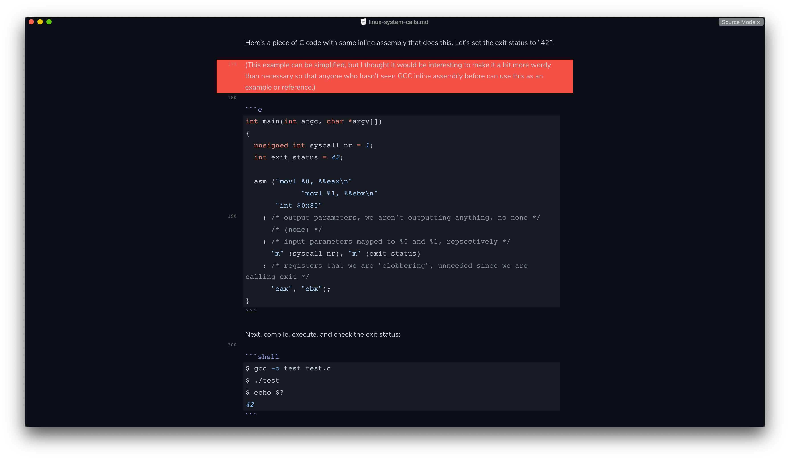
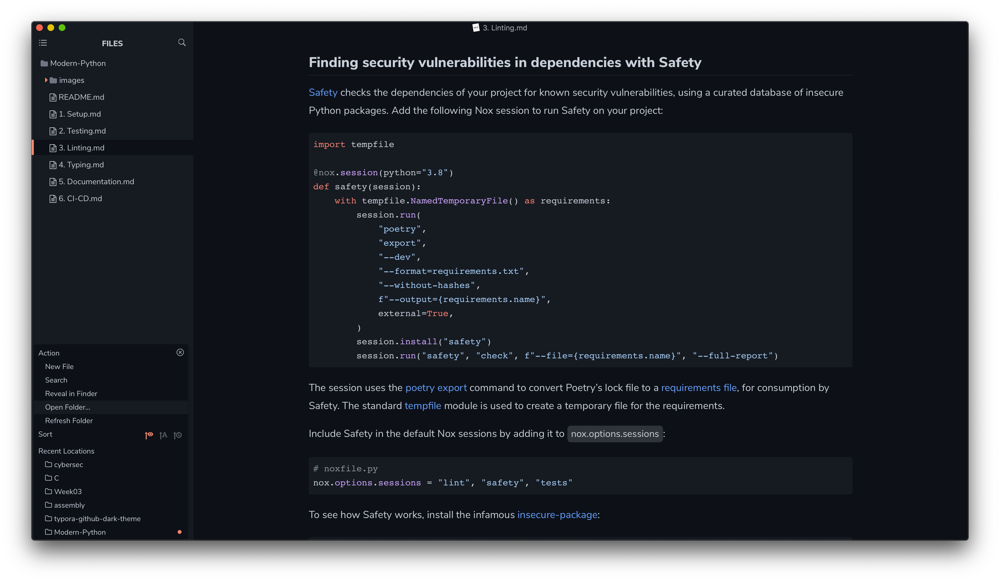
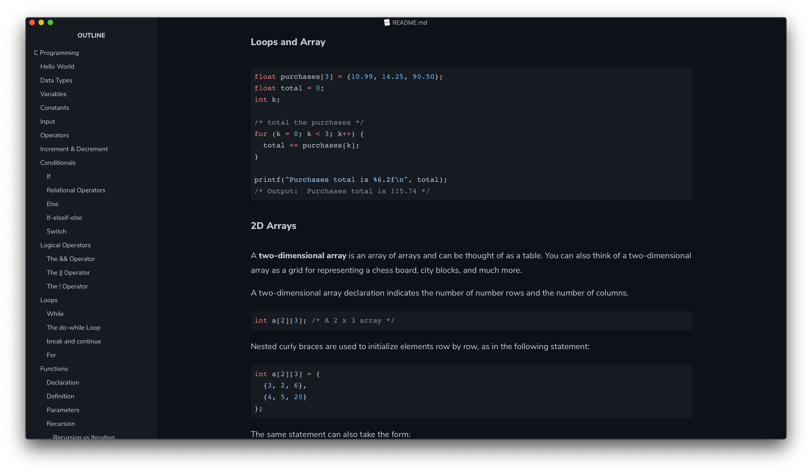

# Github Night Theme for Typora

A dark theme for [Typora](https://typora.io), a multi-platform Markdown Editor, that reproduces the new GitHub Dark Theme, recently deployed on their website.

## Installation

1. Download the zipped project package or the [latest stable release](https://github.com/kinoute/typora-github-night-theme/releases).
2. Launch Typora and open `Preferences` from the app menu.
3. Go to the `Appearance` tab, and choose `Open Theme Folder`.
4. Copy the `github-night.css` file and `github-night` folder to your Typora theme library.
5. Launch or restart Typora and choose `Github Night` from the theme menu.

## Screenshots

### Articles

###  Source Mode

### Focus Mode

### Code Blocks & Folders Menu

### Plan

## Other theme in Typora

I made another theme for Typora, a dark blue one. It's called "Hivacruz" and you can find it here: https://github.com/kinoute/typora-hivacruz-theme.

## Other themes in other apps

I made other themes for different applications. Here there are:

- Sublime Text theme: https://github.com/kinoute/hivacruz-sublime-theme
- VSCode Theme: https://github.com/kinoute/vscode-hivacruz-theme
- iTerm2: https://github.com/kinoute/hivacruz-itermcolors
- Nova: https://github.com/kinoute/hivacruz-nova-theme

## Credits

* Created by [Yann Defretin](https://github.com/kinoute).
* Based on the official GitHub Dark Theme available on their website.
* The Font used is [Nunito](https://fonts.google.com/specimen/Nunito) designed by Vernon Adams.

