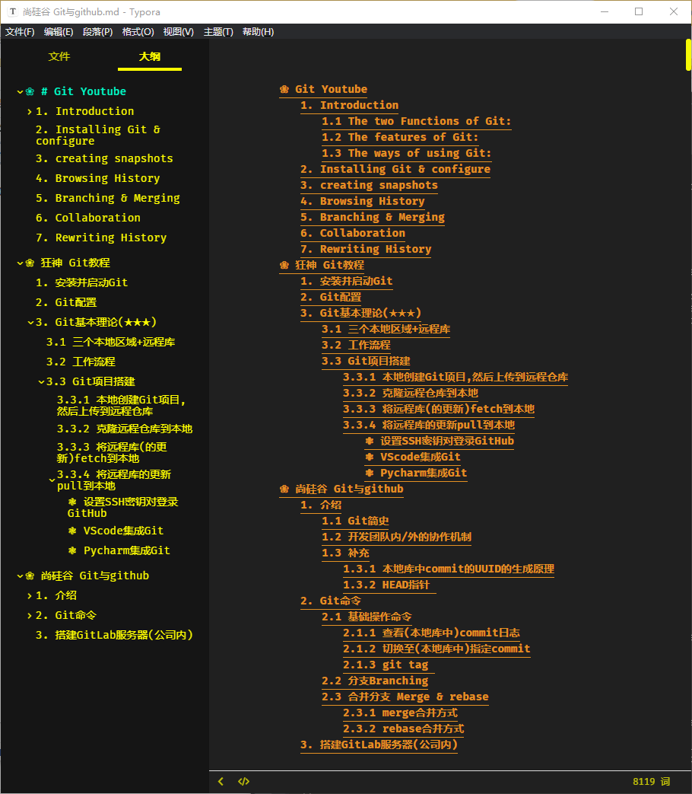
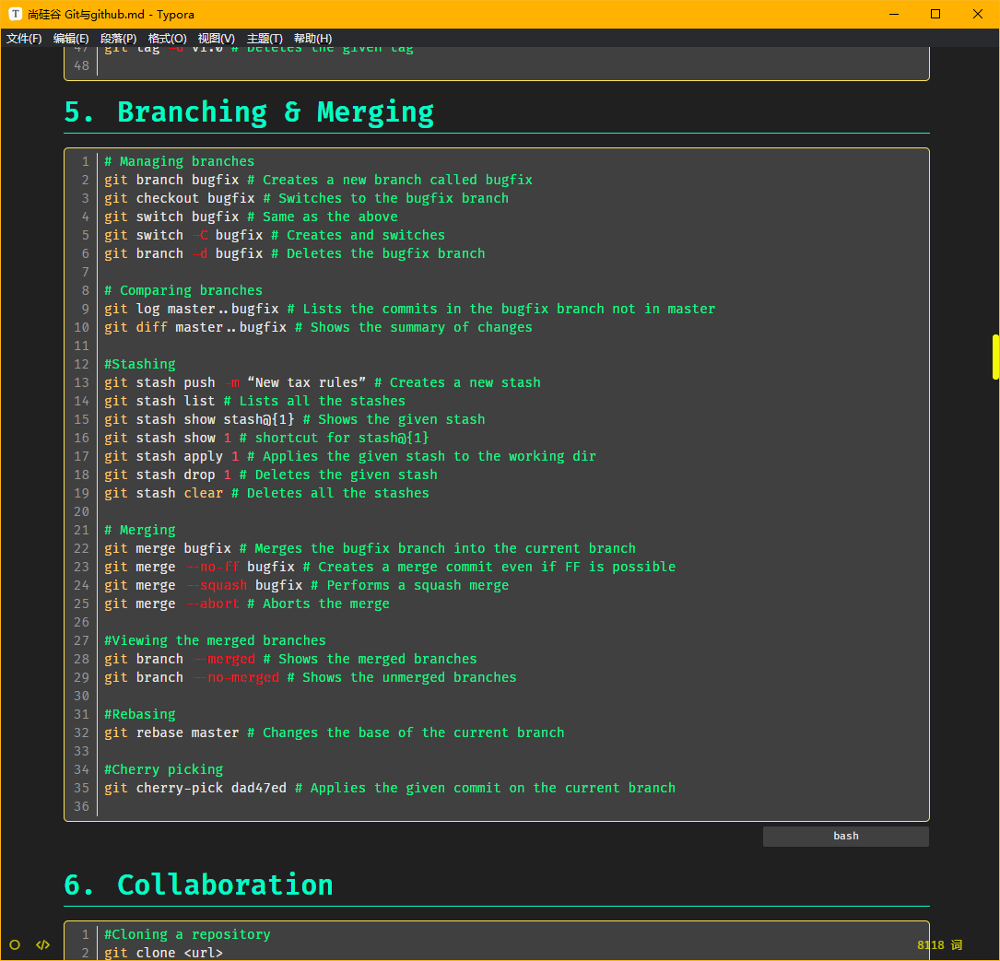

# Jonas Theme for Typora

A dark theme for [Typora](https://typora.io), a multi-platform Markdown Editor, that reproduces the new GitHub Dark Theme, recently deployed on their website.

## Installation

1. Download the zipped project package or the [latest stable release](https://github.com/kinoute/typora-github-night-theme/releases).
2. Launch Typora and open `Preferences` from the app menu.
3. Go to the `Appearance` tab, and choose `Open Theme Folder`.
4. Copy the `github-night.css` file and `github-night` folder to your Typora theme library.
5. Launch or restart Typora and choose `Github Night` from the theme menu.

## Screenshots

###  ToC(Table of Content)

### Code Blocks & Folders Menu

