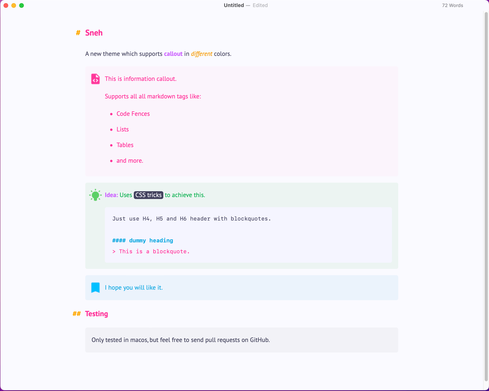
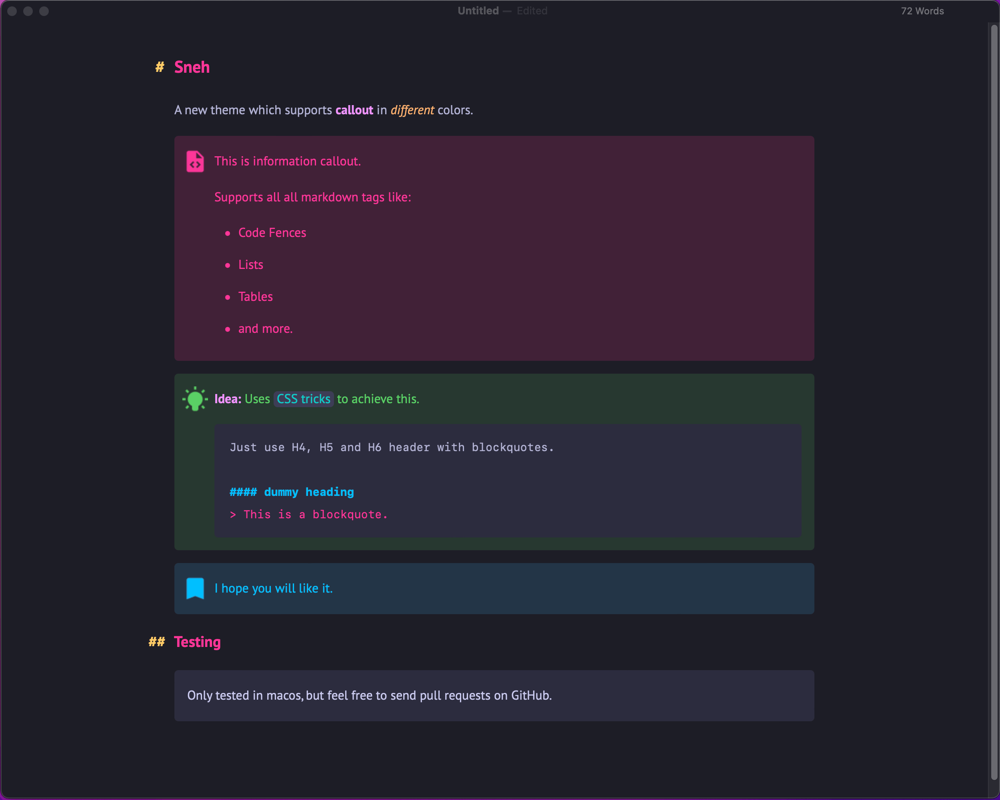
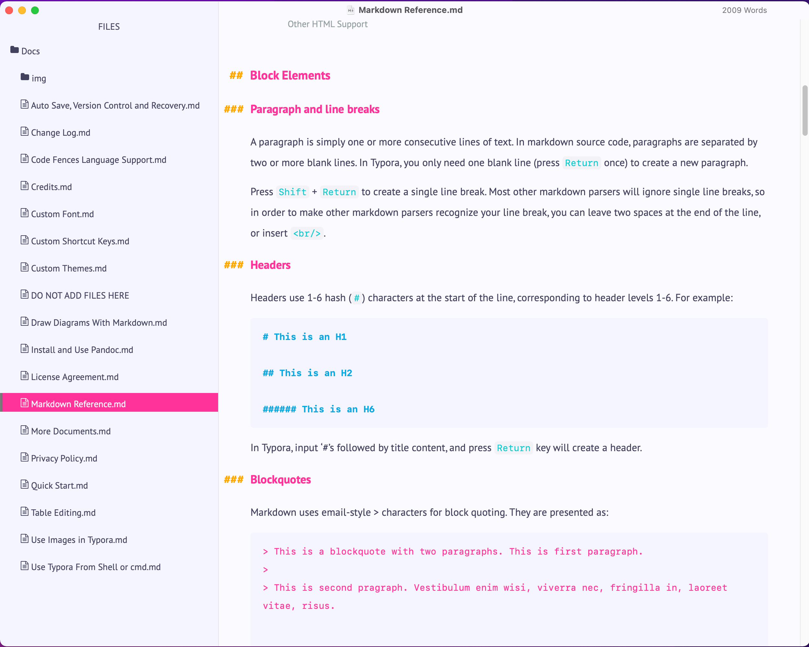
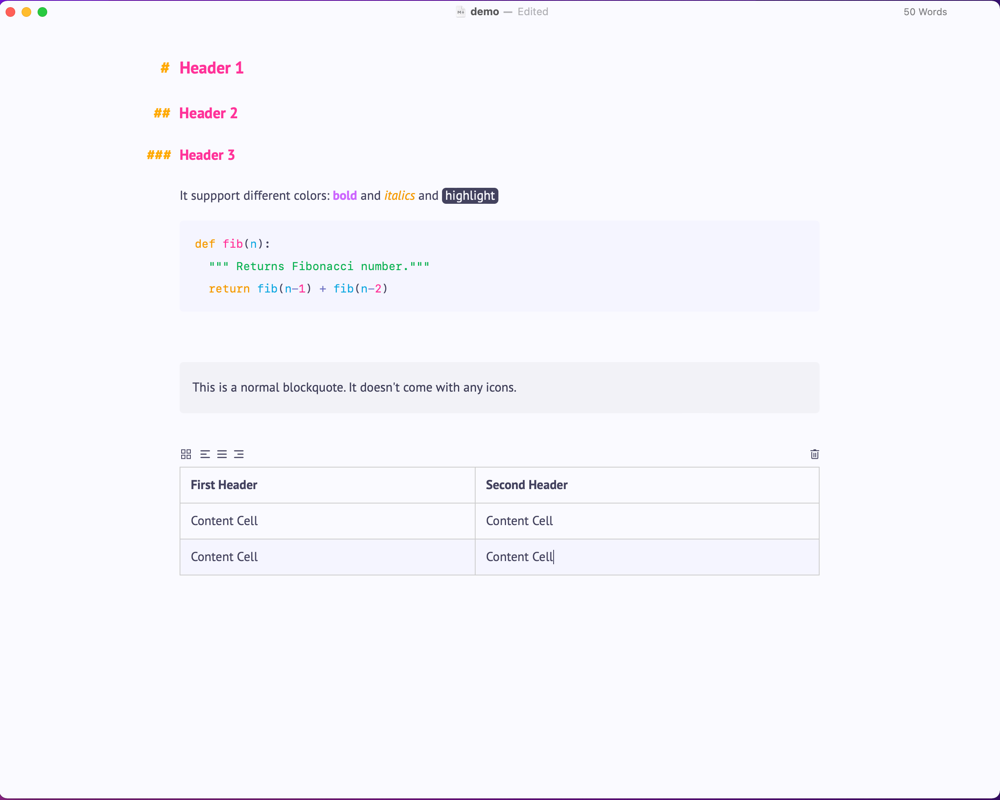
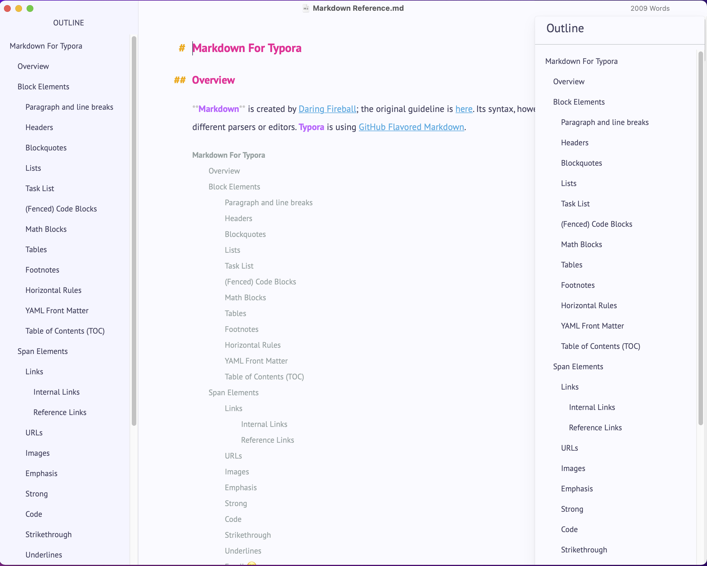
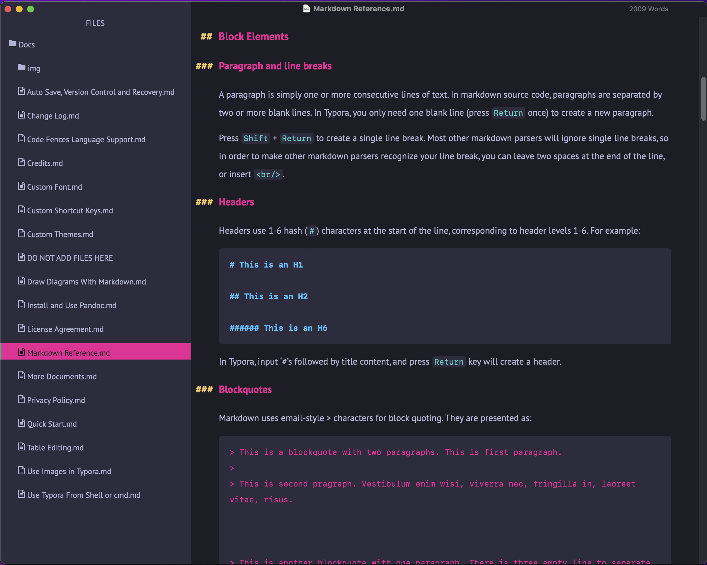
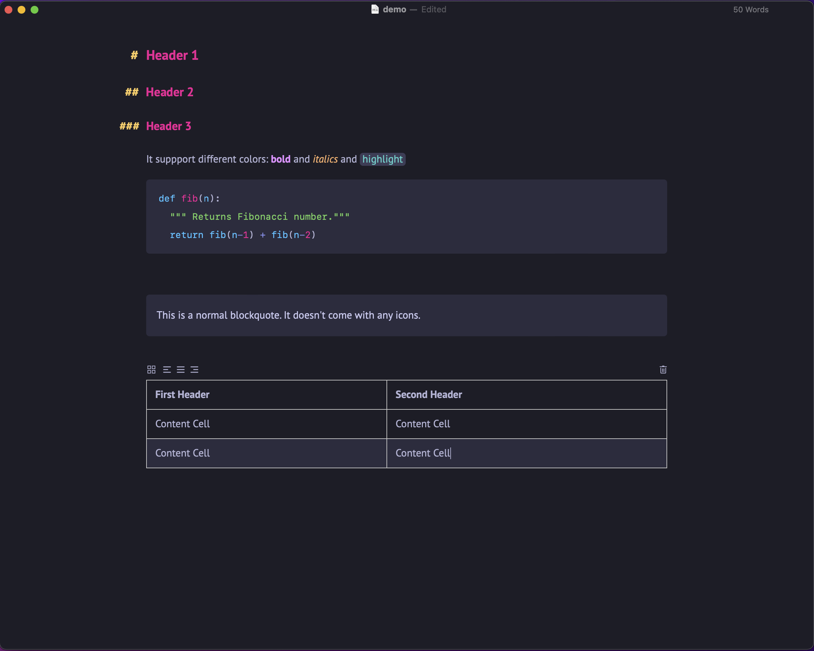
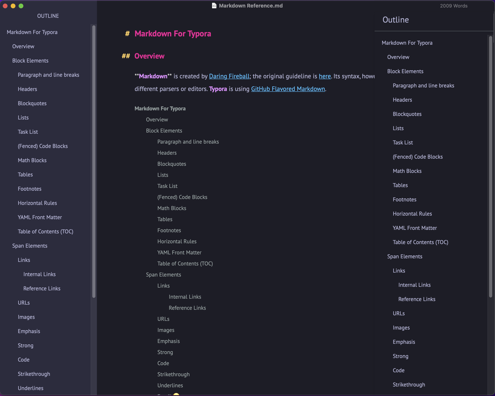

# Sneh

Created it in loving-memory of my mother who passed away due to covid-19. **Sneh** means **Love** in hindi.

This theme features very vibrant colors and supports **Notion** like callout boxes using CSS tricks. **Callout boxes** comes with nice image to add more pleasing user experience. Because Typora doesn't support callout boxes, so this theme uses a CSS trick of adjacent sibling to achieve it. 

> It uses H4, H5, H6 headings with blockquotes. **H4, H5, H6 heading are not shown**.

It support 4 types of callout boxes.

1. Default one which can triggered using blockquote.
```markdown
> This is a message.
```
2. Pink colored one which can be triggered using H4 + blockquote
```markdown
#### put any heading.
> This is a pink color message.
```
3. Green colored one which can be triggered using H5 + blockquote
```markdown
##### put any heading.
> This is a green color message.
```
4. Blue colored one which can be triggered using H6 + blockquote
```markdown
###### put any heading.
> This is a blue color message.
```

# Screenshots

It comes with light and dark version of the theme. 

## Preview





Both light and dark themes have very vibrant colors.

### Light Mode







### Dark Mode








## How to install

1. Download the files **sneh.zip** from the [release](https://github.com/ujwaljain/typora-theme-gallery/releases/download/sneh-1.0/sneh.zip).
2. Open Typora setting, in *Preferences*, click on *Appearance*, then on *Open Theme Folder*
3. Unzip **sneh.zip** into the folder
4. Restart Typora
4. Select the Sneh theme from the *Themes* menu in Typora

## Testing
This has been only tested on MacOS. Please send pull requests on my GitHub for other operating systems.

## Contact
https://github.com/ujwaljain/typora-theme-gallery
