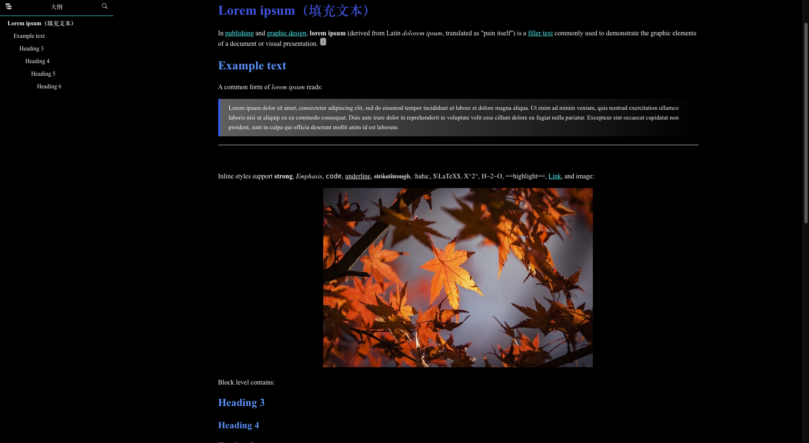
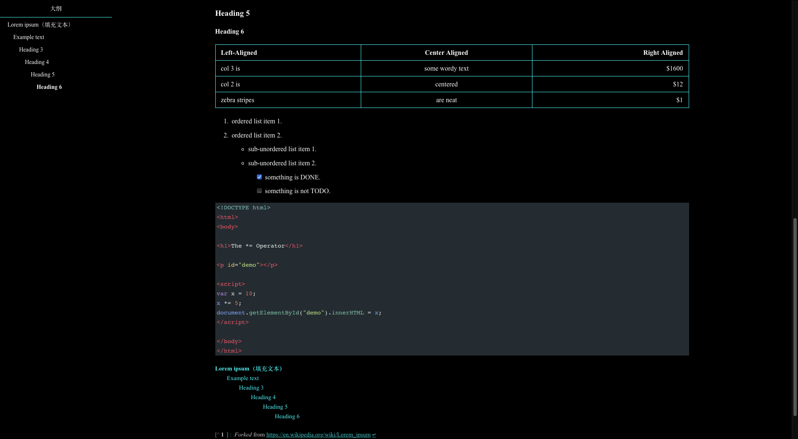
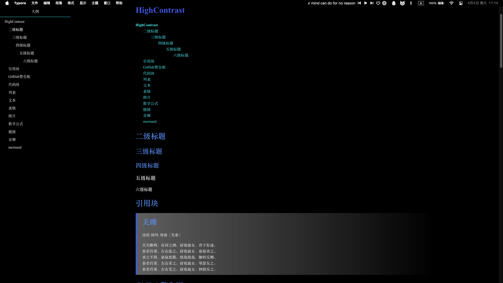
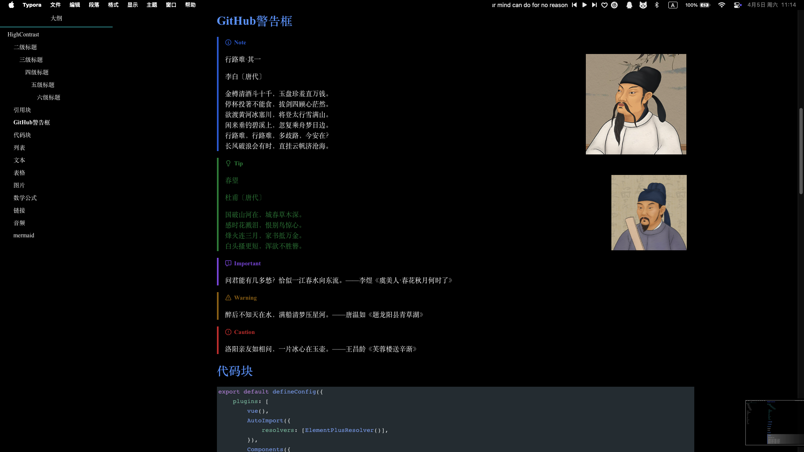
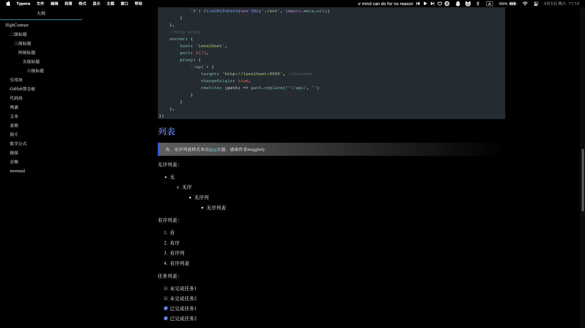
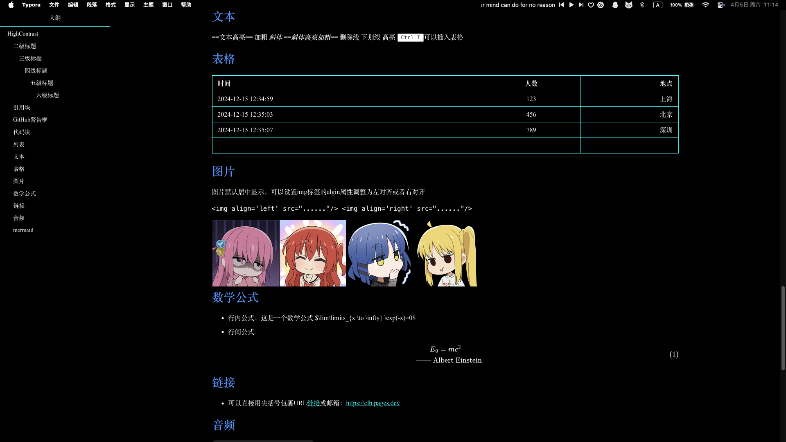
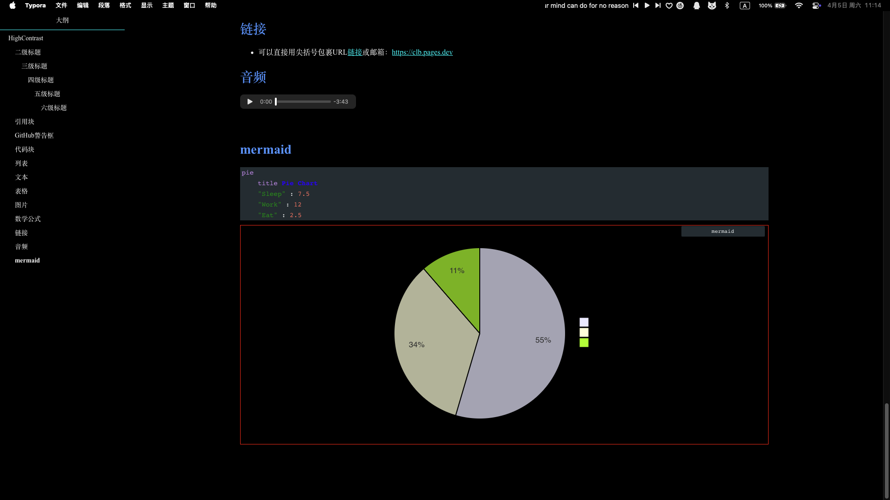

<h1 align='center'>High-Contrast Theme For Typora</h1>

> High-Contrast Theme For Typora is an elegant and practical THEME PACKAGE ，intended for creating a high contrast screen.

<kbd>展开查看更多截图
</kbd>
   
   
   
   
   

## 安装

1. 下载[主题文件](https://github.com/Zervan29131/high-contrast)压缩的项目包。

2. 将 highcontrast.css 文件和 highcontrast 文件夹复制到您的 Typora 主题库。

3. 启动或重新启动 Typora 并从主题菜单中选择高对比度。

## Installation

1. [Download](https://github.com/Zervan29131/high-contrast)the zipped project package from Github.

2. Copy the highcontrast.css file and highcontrast folder to your Typora theme library.

3. Launch or restart Typora and choose highcontrast from the theme menu.

## Credits

